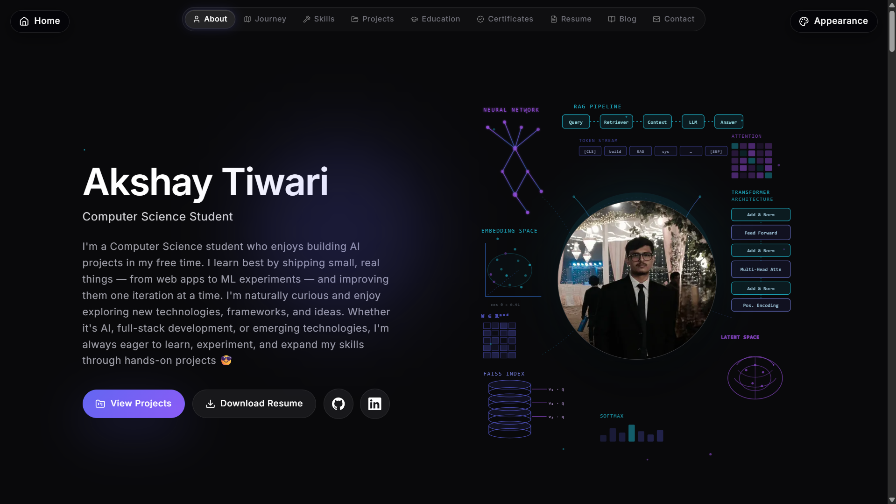
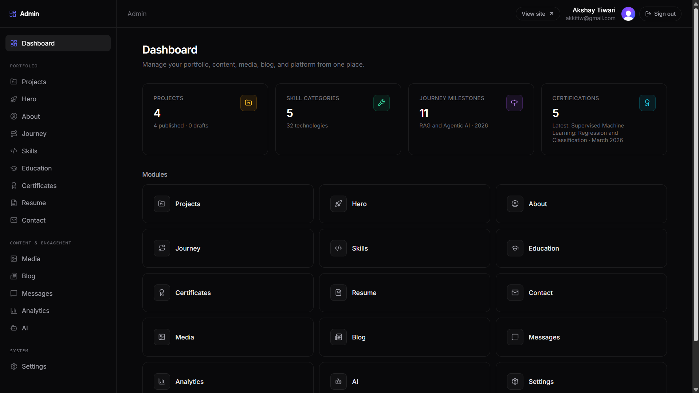
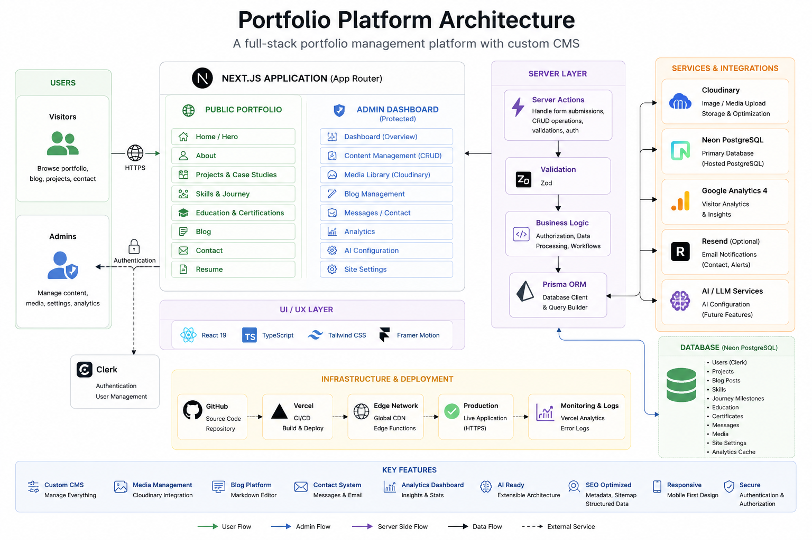

# 🚀 Portfolio Platform

A modern, full-stack portfolio platform built with **Next.js 15**, featuring a fully custom CMS, secure admin dashboard, media management, blogging, analytics, and an AI-ready architecture.

> More than a portfolio website — a complete portfolio management platform.

---

## 📸 Preview

### Public Portfolio



### Admin Dashboard



### Architecture



---

# ✨ Features

## 🌐 Public Portfolio

- Modern responsive UI
- Interactive Hero section
- Project showcase
- Detailed case study pages
- Skills & Journey timeline
- Education & Certifications
- Resume section
- Blog
- Contact form
- SEO optimized
- Dynamic metadata
- Structured data (JSON-LD)

---

## ⚙️ Admin Dashboard

Protected using Clerk Authentication.

Manage everything without editing code.

- Dashboard
- Hero
- About
- Journey
- Skills
- Projects
- Education
- Certifications
- Resume
- Contact
- Blog
- Media Library
- Messages
- Analytics
- AI Configuration
- Site Settings

---

## ☁️ Media Management

- Cloudinary integration
- Image uploads
- Replace/Delete
- Gallery management
- Automatic optimization

---

## 📝 Blog Platform

- Markdown articles
- SEO
- Categories
- Search
- Featured posts
- Draft / Published workflow

---

## 📬 Contact System

Visitors can:

- Send messages

Messages are stored in:

- PostgreSQL
- Admin Dashboard

Optional email notifications via Resend.

---

## 📊 Analytics

- Dashboard
- Google Analytics ready
- CMS statistics
- Portfolio insights

---

# 🛠 Tech Stack

### Frontend

- Next.js 15
- React 19
- TypeScript
- Tailwind CSS
- Framer Motion

### Backend

- Server Actions
- Prisma ORM
- Neon PostgreSQL

### Authentication

- Clerk

### Storage

- Cloudinary

### Deployment

- Vercel

### Validation

- Zod

---

# 🏗 Architecture

```text
Visitor
        │
        ▼
 Next.js App Router
        │
        ▼
 Server Actions
        │
        ▼
     Prisma ORM
        │
        ▼
 Neon PostgreSQL
```

Media

```text
User Upload

↓

Server Action

↓

Cloudinary

↓

Prisma

↓

Public Portfolio
```

---

# 🔒 Security

- Clerk Authentication
- Server-side authorization
- Protected admin routes
- Server Actions
- Environment validation
- Upload validation
- Rate-limited contact form

---

# 📁 Project Structure

```text
src/
 ├── app/
 ├── features/
 ├── components/
 ├── lib/
 ├── providers/
 ├── config/
 └── shared/

prisma/
public/
docs/
```

---

# 🚀 Getting Started

Clone

```bash
git clone https://github.com/RedRanger09/<repo-name>.git
```

Install

```bash
npm install
```

Configure environment

```bash
cp .env.example .env.local
```

Run

```bash
npm run dev
```

---

# 📦 Environment Variables

See

```
.env.example
```

Required services:

- Neon
- Clerk
- Cloudinary

Optional:

- Resend
- Google Analytics

---

# 🚀 Deployment

Designed for deployment on:

- Vercel

Production stack:

- Next.js
- Prisma
- Neon
- Clerk
- Cloudinary

---

# 📈 Future Roadmap

- AI Portfolio Assistant
- Local LLM fallback
- RAG-powered search
- Advanced Analytics
- Email automation

---

# 📄 License

MIT License

---

# 👨‍💻 Author

**Akshay Tiwari**

Computer Science Student

AI / ML Enthusiast

Building practical AI systems, full-stack applications, and intelligent developer tools.

---

⭐ If you like the project, consider giving it a star.