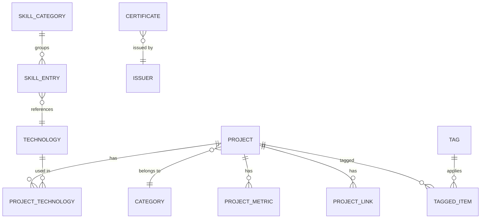
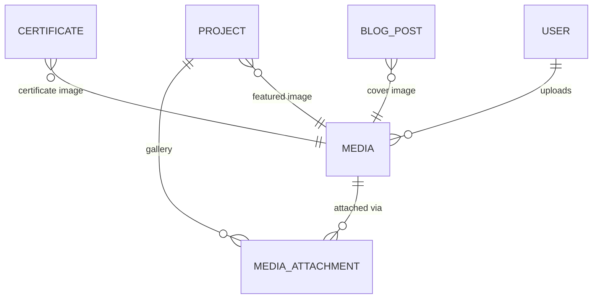
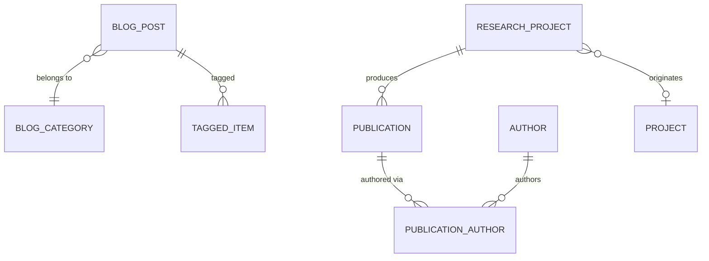
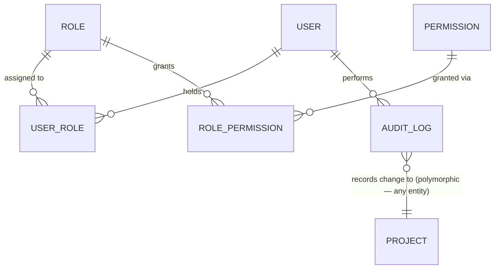
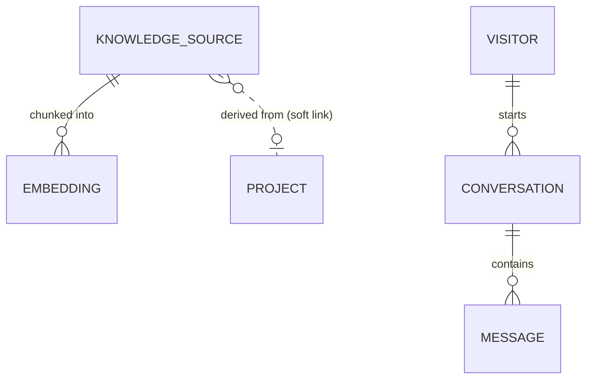

# Domain Model

> Companion to [`system-overview.md`](./system-overview.md). This is the
> single source of truth for entities and relationships — `prisma/schema.prisma`
> (Phase 5) implements this document 1:1. Schema-level design (normalization,
> soft delete, versioning mechanics) lives in [`database-design.md`](./database-design.md);
> this document stays at the conceptual/logical level.

## 1. Modeling conventions

- **Entity** — has its own identity and lifecycle (a row with an `id`).
- **Value object** — has no independent identity; embedded as columns on its
  owning entity (e.g. a `ProjectMetric`'s `label`/`value` pair could be a
  value object *or* an entity — this document explains the choice each time
  it's not obvious).
- Attributes listed are **conceptual**, not SQL types — `database-design.md`
  and the eventual Prisma schema own exact types, defaults, and constraints.
- Cardinality notation: `1─1` (one-to-one), `1─N` (one-to-many), `N─M`
  (many-to-many). An arrow `A → B` means "A references B" (A holds the
  foreign key, or the join table does).
- Every entity listed as **Publishable**, **Versionable**, **Auditable**,
  **Taggable**, **Orderable**, or **Attachable** participates in the
  matching cross-cutting pattern defined in
  [`database-design.md §2`](./database-design.md#2-cross-cutting-schema-patterns).
  Those patterns are defined once there and referenced by name here, rather
  than re-explained per entity.

## 2. Bounded contexts — the map before the territory

```
┌────────────────────┐     ┌────────────────────┐     ┌────────────────────┐
│  Identity & Access  │     │  Configuration      │     │  Audit & Governance│
│  User, Role,        │◄────┤  SiteSettings,      │     │  AuditLog,         │
│  Permission          │     │  FeatureFlag,       │     │  ContentVersion    │
└─────────┬───────────┘     │  HeroContent,        │     └─────────▲──────────┘
          │ acts as          │  AboutContent        │              │ records changes to
          │ actor for        └────────────────────┘              │
          ▼                                                        │
┌─────────────────────────────────────────────────────────────────┴──────────┐
│                          Portfolio Content                                  │
│   Project ─ Category ─ Technology ─ SkillCategory ─ Education ─             │
│   WorkExperience ─ JourneyMilestone ─ Certificate ─ Issuer                  │
└───────────┬─────────────────────────────────┬───────────────────────────────┘
            │ attaches media via                │ referenced by
            ▼                                    ▼
┌────────────────────┐               ┌─────────────────────────┐
│  Media               │               │  Blog & Research          │
│  Media,               │◄──────────────┤  BlogPost, BlogCategory,  │
│  MediaAttachment      │  attaches      │  Publication,             │
└─────────┬───────────┘  media via       │  ResearchProject, Author  │
          │                              └────────────┬──────────────┘
          │ referenced by                              │ indexed by
          ▼                                            ▼
┌────────────────────┐                       ┌─────────────────────────┐
│  Resume              │                       │  AI & Search              │
│  ResumeVersion,       │──── indexed by ─────►│  KnowledgeSource,          │
│  ResumeSection        │                       │  Embedding, Conversation, │
└────────────────────┘                       │  Message, PromptTemplate  │
                                               └─────────────────────────┘
┌────────────────────┐
│  Contact & Engagement│
│  ContactMessage,      │
│  ContactChannel       │
└────────────────────┘
┌────────────────────┐
│  Analytics            │
│  Visitor, PageView,   │
│  Event, Download      │
└────────────────────┘
```

Ten bounded contexts. Each is described fully below. Arrows between context
boxes above are the *only* places one context depends on another — within a
context, entities are free to reference each other richly.

## 3. Identity & Access

| Entity | Purpose | Key attributes | Pattern |
|---|---|---|---|
| **User** | A person with admin-dashboard access. Mirrored from Clerk via webhook — Clerk is the auth system of record, this table is the authorization system of record. | `clerkId`, `email`, `name`, `avatarUrl`, `isOwner` | Auditable |
| **Role** | A named bundle of permissions (Owner, Admin, Editor, Viewer). | `name`, `description` | — |
| **Permission** | A single granular capability, `resource.action` shaped (e.g. `project.publish`). | `key`, `description`, `resource` | — |
| **UserRole** | Join: which role(s) a User holds. Many-to-many even though v1 assigns exactly one, to future-proof multi-role assignment. | `userId`, `roleId` | — |
| **RolePermission** | Join: which permissions a Role grants. | `roleId`, `permissionId` | — |

**Relationships**

- `User` `N─M` `Role` via `UserRole`.
- `Role` `N─M` `Permission` via `RolePermission`.
- `User` `1─N` `AuditLog` (a user is the actor behind many audit entries).
- **Visitors are not Users.** Anonymous public visitors never get a `User`
  row — see the Analytics context (§8). This separation is intentional and
  load-bearing: it means the Identity context never grows proportionally
  with site traffic, only with the number of trusted collaborators.

## 4. Portfolio Content

| Entity | Purpose | Key attributes | Pattern |
|---|---|---|---|
| **Project** | A showcased project (today's `Project` type). | `slug`, `name`, `tagline`, `description`, `status`, `featured`, `pinnedOrder` | Publishable, Versionable, Auditable, Taggable, Attachable |
| **Category** | A project's primary domain (e.g. "AI/ML", "Web"). | `name`, `slug` | Orderable |
| **Technology** | A canonical tool/language/framework — **the single source of truth for "React", "PyTorch", etc.**, shared by Projects *and* Skills (see §4.1 note). | `name`, `slug`, `logoSlug`, `websiteUrl` | — |
| **ProjectTechnology** | Join: which Technologies a Project uses, with display order. | `projectId`, `technologyId`, `order` | Orderable |
| **ProjectMetric** | A labeled stat on a project card (e.g. "10k+ requests handled"). Modeled as an entity, not a JSON blob, so metrics can be queried/aggregated later. | `projectId`, `label`, `value`, `order` | Orderable |
| **ProjectLink** | Generalizes today's `caseStudy` / `github` / `demo` fields into rows, so adding a new link type (e.g. "Docs", "Video walkthrough") never touches the schema. | `projectId`, `type` (`CASE_STUDY \| GITHUB \| DEMO \| DOCS \| OTHER`), `url`, `label` | Orderable |
| **SkillCategory** | A skills-section grouping (Programming, AI/ML, Frameworks…). | `name`, `icon`, `accentColor`, `note`, `order` | Orderable |
| **SkillEntry** | Join: which Technologies belong to a SkillCategory, with optional proficiency. | `skillCategoryId`, `technologyId`, `proficiency?`, `order` | Orderable |
| **Education** | An academic entry (school/college). | `institution`, `degree`, `period`, `location`, `description`, `highlights[]` | Auditable |
| **WorkExperience** | *(New — not in today's static data.)* A future work-history entry, modeled now so the schema doesn't need a shape change the day it's needed. | `company`, `role`, `period`, `location`, `description`, `responsibilities[]` | Auditable |
| **JourneyMilestone** | A "Learning Journey" timeline entry. | `label`, `year`, `description`, `icon`, `accentColor`, `isCurrent`, `subItems[]`, `order` | Orderable, Auditable |
| **Certificate** | A completed certification. | `name`, `completionDate`, `credentialUrl`, `verifyUrl` | Attachable, Auditable |
| **Issuer** | A certificate's issuing organization (Coursera, IBM, NVIDIA…) — extracted so "IBM"'s logo/name/website is defined once, not per certificate. | `name`, `logoSlug`, `websiteUrl` | — |

**Relationships**

- `Project` `N─1` `Category`.
- `Project` `N─M` `Technology` via `ProjectTechnology`.
- `Project` `1─N` `ProjectMetric`.
- `Project` `1─N` `ProjectLink`.
- `Project` `N─M` `Tag` via the shared Taggable pattern.
- `Project` `1─N` `MediaAttachment` (gallery images) `+` `1─1` `Media` (featured image, direct FK).
- `SkillCategory` `1─N` `SkillEntry` `N─1` `Technology`.
- `Certificate` `N─1` `Issuer`.
- `Certificate` `1─1` `Media` (certificate image, direct FK).
- `Education`, `WorkExperience`, `JourneyMilestone` have **no foreign keys
  into each other** — see the design note below.

> **Design note — why Education / WorkExperience / JourneyMilestone stay
> separate tables instead of one polymorphic `TimelineEvent`.** All three
> conceptually render as "a dated card on a timeline," which makes a unified
> table tempting. It's deliberately rejected: their fields diverge enough
> (`highlights[]` + `expectedGraduation` vs. `responsibilities[]` +
> `company` vs. `subItems[]` + `isCurrent`) that a unified table would need
> a wide set of nullable columns or a `jsonb` payload — either way, weaker
> typing and validation than three small, honest tables. Nothing in the UI
> today or planned needs to *query across* all three as one collection; if
> that need appears later (e.g. a combined "My Story" timeline view), a
> Postgres `VIEW` or a `UNION`-based query composes the three at read time
> without a schema change.

### 4.1 Why `Technology` is one shared entity, not two

Today's static data has two separate shapes for "the same thing": Hero's
tech orbs, Skills' `SkillItem { name, logo }`, and Projects' `techStack:
string[]`. All three describe the same real-world concept — a tool or
language. Modeling `Technology` once means:

- "React"'s logo slug is defined in exactly one place.
- A future "which projects use this technology?" page is a single join,
  not a fuzzy string match across three data shapes.
- Renaming or re-branding a technology (e.g. "Google Gemini" → "Gemini API")
  is a one-row update that instantly reflects everywhere it's used.

## 5. Media

| Entity | Purpose | Key attributes | Pattern |
|---|---|---|---|
| **Media** | Any uploaded asset — the canonical record of a file, regardless of what uses it. | `url`, `provider` (`CLOUDINARY \| LOCAL`), `type` (`IMAGE \| VIDEO \| PDF`), `width?`, `height?`, `altText`, `sizeBytes`, `uploadedById` | Auditable |
| **MediaAttachment** | Polymorphic join: attaches a `Media` row to any other entity's named "slot" (e.g. a Project's 3rd gallery image). | `mediaId`, `attachableType`, `attachableId`, `role` (e.g. `GALLERY`, `INLINE`), `order` | Orderable |

**Relationships** — see the **Media Attachment pattern** in
`database-design.md §2.2` for the full reasoning on when an entity gets a
direct `mediaId` foreign key (singleton image slots: `Project.featuredImageId`,
`Certificate.imageId`, `BlogPost.coverImageId`) vs. a `MediaAttachment` row
(one-to-many slots: Project galleries, in-post Blog images).

- `Media` `1─N` `MediaAttachment`.
- `Media` `1─N` Project/Certificate/BlogPost/etc. (direct FK, singleton slots).
- `User` `1─N` `Media` (`uploadedById` — who uploaded it, for audit/ownership).

## 6. Blog & Research

| Entity | Purpose | Key attributes | Pattern |
|---|---|---|---|
| **BlogPost** | A long-form article. | `slug`, `title`, `excerpt`, `content` (rich text/MDX), `status`, `publishedAt`, `readingTimeMinutes` | Publishable, Versionable, Auditable, Taggable, Attachable |
| **BlogCategory** | A single top-level grouping per post (e.g. "AI/ML Notes", "Project Deep-Dives"). | `name`, `slug` | Orderable |
| **Publication** | A paper/article Akshay authored or co-authored. | `title`, `abstract`, `venue`, `publishedDate`, `doiUrl`, `pdfMediaId?` | Versionable, Auditable |
| **ResearchProject** | A larger, ongoing research effort that may produce multiple Publications and relate to a portfolio `Project`. | `title`, `description`, `status`, `startedAt` | Publishable, Auditable |
| **Author** | A co-author, modeled as an entity (not a text field) so the same person is reused across multiple Publications. | `name`, `affiliation?`, `profileUrl?` | — |
| **PublicationAuthor** | Join: ordered author list per Publication. | `publicationId`, `authorId`, `order` | Orderable |

**Relationships**

- `BlogPost` `N─1` `BlogCategory`.
- `BlogPost` `N─M` `Tag` via Taggable (the **same** `Tag` table Projects use — see §9.1).
- `ResearchProject` `1─N` `Publication`.
- `ResearchProject` `N─1` `Project` (optional — a research effort *can* be the origin of a showcased Project).
- `Publication` `N─M` `Author` via `PublicationAuthor`.

## 7. Resume

| Entity | Purpose | Key attributes | Pattern |
|---|---|---|---|
| **ResumeVersion** | An uploaded resume PDF + its preview image, versioned. Replaces today's single static `SITE.resumePath`. | `fileMediaId`, `previewImageMediaId`, `label` (e.g. "2026 — SWE focus"), `isActive`, `changeSummary`, `effectiveDate` | Versionable (via its own version number, not the generic pattern — see `database-design.md §7`), Auditable |
| **ResumeSection** *(future / optional)* | A curated pointer into existing content (a Project, Education entry, WorkExperience, or Certificate) marked for inclusion in an auto-generated resume. See `future-roadmap.md §3`. | `resumeVersionId?`, `sourceType`, `sourceId`, `includeInResume`, `order` | Orderable |

**Relationships**

- `ResumeVersion.isActive` — exactly one row is active at a time (the one
  served by "Download Resume" today); enforced at the application layer, not
  a DB constraint, because "exactly one true boolean" constraints are
  awkward in SQL and the write volume (an admin manually publishing a new
  resume version) doesn't justify the complexity.
- `ResumeSection` optionally references `Project` / `Education` /
  `WorkExperience` / `Certificate` polymorphically — only relevant once the
  generated-resume feature (a v2/AI-adjacent idea) is built.

## 8. Contact & Engagement

| Entity | Purpose | Key attributes | Pattern |
|---|---|---|---|
| **ContactMessage** | An inbound message from the public contact form. | `name`, `email`, `subject?`, `message`, `status` (`UNREAD \| READ \| REPLIED \| ARCHIVED`), `ipHash?` | Auditable (status changes logged) |
| **ContactChannel** | Today's `ContactMethod` cards (GitHub/LinkedIn/Email/Location), made admin-editable rather than hardcoded. | `label`, `value`, `href`, `icon`, `order`, `isVisible` | Orderable |

**Relationships** — both are leaf entities; neither is referenced by
anything else. `ContactMessage` is written by the public site (the one
sanctioned public write path — see `database-design.md §8`) and read/updated
by the admin Messages module.

## 9. Cross-context: Tagging

| Entity | Purpose | Key attributes | Pattern |
|---|---|---|---|
| **Tag** | A single freeform label (e.g. "RAG", "Beginner-friendly"), shared across content types. | `name`, `slug` | — |
| **TaggedItem** | Polymorphic join: attaches a Tag to any Taggable entity. | `tagId`, `taggableType`, `taggableId` | — |

### 9.1 Why one `Tag` table, not `ProjectTag` + `BlogTag` + `PublicationTag`

A tag like "RAG" or "Beginner-friendly" is conceptually the same label
whether it's on a Project or a Blog post. One shared, polymorphic `Tag` +
`TaggedItem` pair (the **Taggable pattern**, detailed in
`database-design.md §2.1`) means:

- A future "browse everything tagged RAG" page is one query across content types.
- Renaming a tag is a one-row update, not a multi-table update.
- Adding a new taggable content type (e.g. Publications) needs zero schema
  change — just start writing `TaggedItem` rows with that `taggableType`.

## 10. Analytics

| Entity | Purpose | Key attributes | Pattern |
|---|---|---|---|
| **Visitor** | An anonymous/pseudonymous visitor, identified by a first-party cookie ID — **never** linked to a `User`. | `anonymousId`, `firstSeenAt`, `lastSeenAt`, `country?`, `deviceType?`, `referrer?` | — |
| **PageView** | One page load. | `visitorId`, `path`, `viewedAt`, `durationSeconds?` | — |
| **Event** | A generic, flexible analytics event (button click, project card opened, chatbot opened) — deliberately schema-light (`payload: jsonb`) since new event types will be added far more often than new entities should be. | `visitorId`, `eventType`, `payload (jsonb)`, `occurredAt` | — |
| **Download** | A tracked file download (resume, project asset). | `visitorId`, `mediaId?` or `resumeVersionId?`, `downloadedAt` | — |

**Relationships**

- `Visitor` `1─N` `PageView`, `1─N` `Event`, `1─N` `Download`.
- This context is deliberately **isolated**: nothing outside Analytics has
  a foreign key pointing into it, and Analytics has no foreign keys pointing
  out except the loose, optional links above. It can be disabled, truncated,
  or swapped for a third-party product without touching any other context —
  by design (see `system-overview.md §1.2, principle 8`).

## 11. AI & Search

| Entity | Purpose | Key attributes | Pattern |
|---|---|---|---|
| **KnowledgeSource** | A normalized, indexable unit of knowledge — one row per Project/BlogPost/Publication/manual fact, regardless of the underlying content type. | `sourceType` (`PROJECT \| BLOG_POST \| PUBLICATION \| RESUME \| MANUAL`), `sourceId?` (null for `MANUAL`), `title`, `extractedText`, `lastIndexedAt` | Auditable |
| **Embedding** | One vector for one chunk of a `KnowledgeSource`'s text. | `knowledgeSourceId`, `chunkIndex`, `chunkText`, `vector` (pgvector), `model` | — |
| **Conversation** | One chatbot session with a Visitor. | `visitorId?`, `startedAt`, `endedAt?` | — |
| **Message** | One turn in a Conversation. | `conversationId`, `role` (`USER \| ASSISTANT`), `content`, `retrievedKnowledgeSourceIds (jsonb)`, `tokensUsed?` | — |
| **PromptTemplate** | A versioned, admin-editable system prompt for the assistant. | `name`, `content`, `isActive`, `version` | Versionable |

**Relationships**

- `KnowledgeSource` `1─N` `Embedding`.
- `Conversation` `1─N` `Message`.
- `Conversation` `N─1` `Visitor` (optional — a conversation can be anonymous
  even relative to the Analytics context, e.g. started from a context with
  no prior page views tracked).
- `KnowledgeSource.sourceId` is a **soft reference** (no DB-level foreign
  key) into whichever table `sourceType` names — deliberately, so deleting a
  `Project` doesn't cascade-fail on an `Embedding` row; a nightly/on-demand
  reconciliation job (see `future-roadmap.md §1.4`) prunes orphaned
  `KnowledgeSource` rows instead.

Full AI/RAG data flow (ingestion → embedding → retrieval → chat) is in
[`future-roadmap.md §1`](./future-roadmap.md#1-ai--rag-architecture).

## 12. Configuration

| Entity | Purpose | Key attributes | Pattern |
|---|---|---|---|
| **SiteSettings** | A singleton row (exactly one, enforced at the application layer) for well-known, rarely-changing site identity fields. | `siteName`, `siteUrl`, `defaultSeoTitle`, `defaultSeoDescription`, `defaultOgImageId?`, `contactEmail` | Auditable |
| **FeatureFlag** | A key/value toggle for features that get added over time (`enableBlog`, `enableAiAssistant`, `enableAnalytics`) — a table, not columns on `SiteSettings`, specifically because *new flags will be added constantly* and a table needs no migration to add a row. | `key`, `value` (boolean/json), `description` | Auditable |
| **HeroContent** | Singleton row for the Hero section's editable copy (today's `hero/data.ts`). | `eyebrow`, `title`, `subtitle`, `description`, `profileImageId` | Versionable, Auditable |
| **AboutContent** | Singleton row for the About section's editable copy. | `story[]`, `currentlyLearningTitle`, `currentlyLearningItems[]`, `interests[]` | Versionable, Auditable |

**Relationships** — `HeroContent`/`AboutContent` reference `Media` for their
images; `SiteSettings` references `Media` for a default OG image. See
`cms-design.md §3` for the full reasoning on why these are singleton content
tables rather than rows in a generic key/value store, and why `Navigation`
deliberately **stays code** rather than becoming a table (also `cms-design.md §3`).

## 13. Full relationship inventory

| From | Relationship | To | Cardinality |
|---|---|---|---|
| Project | belongs to | Category | N─1 |
| Project | uses | Technology (via ProjectTechnology) | N─M |
| Project | has | ProjectMetric | 1─N |
| Project | has | ProjectLink | 1─N |
| Project | tagged with | Tag (via TaggedItem) | N─M |
| Project | has gallery of | Media (via MediaAttachment) | 1─N |
| Project | has featured | Media | 1─1 |
| Project | has many | ContentVersion | 1─N |
| Project | originates from | ResearchProject | 1─0..1 |
| SkillCategory | groups | SkillEntry | 1─N |
| SkillEntry | references | Technology | N─1 |
| Certificate | issued by | Issuer | N─1 |
| Certificate | has image | Media | 1─1 |
| BlogPost | belongs to | BlogCategory | N─1 |
| BlogPost | tagged with | Tag (via TaggedItem) | N─M |
| BlogPost | has cover | Media | 1─1 |
| BlogPost | has inline images | Media (via MediaAttachment) | 1─N |
| ResearchProject | produces | Publication | 1─N |
| Publication | authored by | Author (via PublicationAuthor) | N─M |
| ResumeVersion | file is | Media | 1─1 |
| ResumeVersion | preview is | Media | 1─1 |
| ResumeSection | points to | Project / Education / WorkExperience / Certificate | N─1 (polymorphic) |
| ContactMessage | — (leaf) | — | — |
| ContactChannel | — (leaf) | — | — |
| User | holds | Role (via UserRole) | N─M |
| Role | grants | Permission (via RolePermission) | N─M |
| User | performs | AuditLog | 1─N |
| User | uploads | Media | 1─N |
| Media | attached via | MediaAttachment | 1─N |
| Visitor | has | PageView | 1─N |
| Visitor | has | Event | 1─N |
| Visitor | has | Download | 1─N |
| Visitor | starts | Conversation | 1─N |
| Conversation | contains | Message | 1─N |
| KnowledgeSource | has | Embedding | 1─N |
| KnowledgeSource | derived from | Project / BlogPost / Publication / ResumeVersion | N─1 (soft, polymorphic) |
| ContentVersion | snapshots | Project / BlogPost / Publication / HeroContent / AboutContent / PromptTemplate | N─1 (polymorphic) |
| AuditLog | records change to | *any entity* | N─1 (polymorphic) |

## 14. Example expanded relationship tree — Project

To match the exact shape requested — the fully expanded picture for the
platform's central entity:

```
Project
 │
 ├── N─M → Technology            (via ProjectTechnology, ordered)
 ├── N─1 → Category
 ├── N─M → Tag                   (via TaggedItem)
 ├── 1─N → ProjectMetric         (ordered)
 ├── 1─N → ProjectLink           (ordered: CASE_STUDY, GITHUB, DEMO, DOCS...)
 ├── 1─1 → Media                 (featuredImageId — direct FK)
 ├── 1─N → MediaAttachment       (gallery, ordered) → Media
 ├── 0..1─N → ResearchProject     (optional: this project originated from research)
 ├── 1─N → ContentVersion         (every published edit, snapshotted)
 ├── 1─N → AuditLog               (who changed what, when)
 └── 0..1─1 → KnowledgeSource     (soft link — indexed for the AI assistant once published)
```

## 15. Mermaid ER diagrams (by bounded context)

Rendered wherever Mermaid is supported (GitHub, most doc viewers); kept as
plain text here so this document has no build step.

### 15.1 Portfolio Content



### 15.2 Media



### 15.3 Blog & Research



### 15.4 Identity, Audit & Configuration



### 15.5 AI & Search


